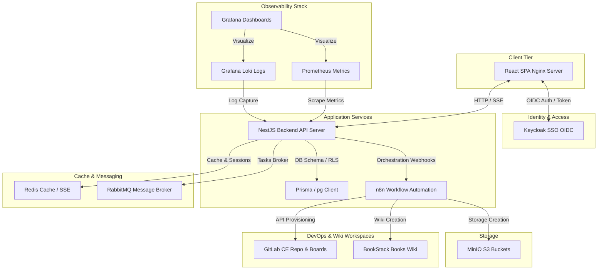
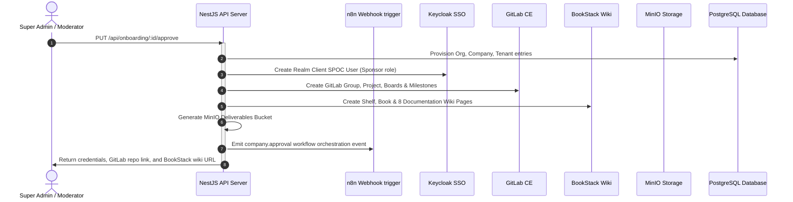

# APNILEAP System Architecture & Workflow Walkthrough

This document outlines the system architecture, modular NestJS backend structure, and verification instructions for the production-ready open-source stack of the APNILEAP platform.

---

## 1. High-Level System Architecture

The following diagram illustrates the interactions between the React frontend, NestJS backend API gateways, and the integrated open-source infrastructure tools:



---

## 2. Modular NestJS Backend Layout

The backend application is organized into NestJS modules inside `backend/src/`:

1. **AuthModule**: Handles OIDC login flow, token signatures verification, and role-based access control (RBAC).
2. **OrganizationModule**: CRUD controllers for Organizations, Companies, Colleges, and Departments with search filtering.
3. **OnboardingModule**: Handles company registration requests review and approvals.
4. **GitlabModule**: GitLab subgroups, projects, milestones, issue boards provisioning, and webhook receiver.
5. **BookstackModule**: Automates Wiki Shelf, Book, and 8 standard templates page creation.
6. **N8nModule**: Broadcasts event payloads to n8n webhook listeners.
7. **TasksModule**: Manages local task caching and background GitLab Issues transitions.
8. **StorageModule**: Direct files uploads and presigned URL retrievals using MinIO S3.
9. **SubmissionsModule**: Reviews deliverables and triggers automatic task transitions.
10. **AuditModule**: Centralized activity feed logger registering user/admin logs.
11. **AnalyticsModule**: Aggregates project statistics, Spoke status tallies, and blockers.

---

## 3. End-to-End Onboarding & Workspace Setup

When a company onboarding registration is approved by a Super Admin:



---

## 4. Setup & Running Instructions

### Option A: Running Locally (Developer Fallback Mode)
Because we have implemented robust, hybrid fallback layers, the platform does not require Docker to run locally. If the containerized services are offline, the authentication and workspace setups will fallback to local PostgreSQL and mock urls seamlessly.

1. **Start the NestJS Backend**:
   ```bash
   cd backend
   npm install
   npm run start:dev
   ```
   *The backend REST API server will start on `http://localhost:5000`.*

2. **Start the React Frontend**:
   ```bash
   cd frontend
   npm install --legacy-peer-deps
   npm start
   ```
   *The React dashboard web interface will start on `http://localhost:3000`.*

---

### Option B: Self-Hosted Production Stack (Docker)
To run the full self-hosted suite in containers:

1. Ensure **Docker Desktop** is active.
2. Spin up the containers:
   ```bash
   docker-compose up -d
   ```
3. Exposed Services:
   - **GitLab CE**: `http://localhost:8080`
   - **Keycloak SSO**: `http://localhost:8081`
   - **BookStack Wiki**: `http://localhost:8082`
   - **MinIO S3**: `http://localhost:9000`
   - **n8n Engine**: `http://localhost:5678`
   - **Prometheus Scrapers**: `http://localhost:9090`
   - **Grafana Metrics**: `http://localhost:3000`
